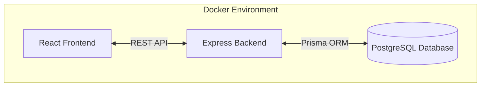

# Project Architecture

This document describes the global architecture of the AI-Week project and the responsibilities of its various components.

## Overview

The application follows a standard **Client-Server** architecture (3-tier) composed of a React frontend, an Express backend, and a PostgreSQL database.

---

## 🏗️ Components & Responsibilities

### 1. Frontend (Client)
Developed with **React 19**, **TypeScript**, and **Vite**.

- **Responsibilities**:
    - **User Interface (UI)**: Rendering the dashboard, schedule, grades, and messaging interfaces.
    - **Client-side Routing**: Managed via `react-router-dom` (defined in `src/App.tsx`).
    - **State Management**: Global application state is handled through `AppContext`, providing users, courses, and attendance data to components.
    - **Security**: Conditional rendering and access control based on user roles (`ELEVE`, `PO`, `TUTEUR`, `DIRECTION`).
    - **Communication**: Interacts with the backend via the `/api` prefix (proxied during development).

### 2. Backend (Server)
Developed with **Node.js**, **Express**, and **TypeScript**.

- **Responsibilities**:
    - **API Gateway**: Provides REST endpoints for all major features (Auth, Schedule, Grades, Tasks, Messages).
    - **Authentication**: User login and registration using hashed passwords (`bcryptjs`).
    - **Business Logic**: Validation of requests and role-based data filtering.
    - **Data Orchestration**: Uses **Prisma ORM** to perform type-safe database queries.
    - **Bootstrapping**: Automatically initializes a default administrator account on startup.

### 3. Data Layer (Database)
Managed via **Prisma** with a **PostgreSQL** provider.

- **Responsibilities**:
    - **Persistence**: Storing relational data (Users, Courses, Grades, Sessions, Messages).
    - **Data Integrity**: Enforcing relationships and unique constraints (e.g., matching a grade to both a student and a course).
    - **Schema Versioning**: Managed via Prisma Migrations.

---

## 🛠️ Infrastructure & Development

### Docker
The project uses `docker-compose` to ensure a consistent environment:
- `web` service: Handles the frontend and backend execution.
- `db` service: Runs the PostgreSQL 14 instance.

### Development Proxy
During development, the Vite configuration (`vite.config.ts`) includes a proxy to forward requests starting with `/api` to the backend server (defaulting to port 3001), simplifying local development and avoiding CORS issues.

---

## 🔐 Security Principles
- **Password Safety**: No plain-text passwords stored (all hashed via bcrypt).
- **Least Privilege**: Application roles strictly control what data a user can view or modify.
- **Environment Isolation**: Sensitive configuration (Database URLs, Ports) is managed via `.env` files.
