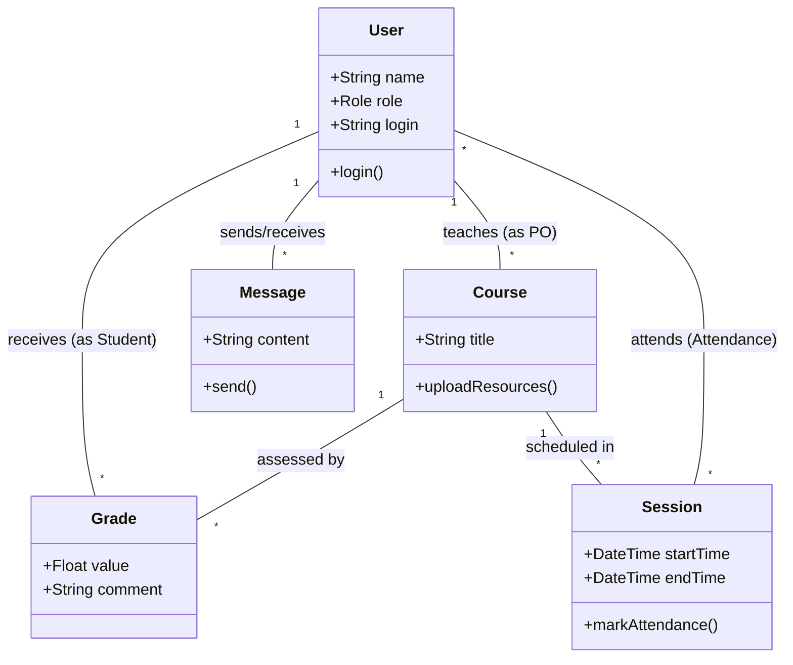

# Modèle de Domaine et Modélisation des Données

Ce document présente la structure conceptuelle (Domaine) et physique (Données) de l'application **AI-Week**.

## 1. Modèle de Domaine (Conceptuel)

Le modèle de domaine décrit les entités métier et leurs interactions sans se soucier de l'implémentation technique.



### Acteurs et Responsabilités
- **Student (Élève)** : Consulte ses notes, assiste aux sessions, échange des messages.
- **Product Owner (PO)** : Gère ses cours, planifie des sessions, évalue les élèves.
- **Tutor (Tuteur)** : Accompagne les élèves, suit les présences.
- **Direction** : Administre les comptes, assigne les rôles et les classes.

---

## 2. Modèle de Données (Physique - ERD)

Le modèle de données représente la structure réelle des tables dans la base de données PostgreSQL, telle que définie par le schéma Prisma.

```mermaiderDiagram
    USER ||--o{ GRADE : "receives"
    USER ||--o{ COURSE : "manages (PO)"
    USER ||--o{ SESSION : "teaches (PO)"
    USER ||--o{ ATTENDANCE : "marks"
    USER ||--o{ MESSAGE : "sends/receives"
    USER ||--o{ DOCUMENT : "uploads"
    
    COURSE ||--o{ GRADE : "is assessed by"
    COURSE ||--o{ SESSION : "has many"
    
    SESSION ||--o{ ATTENDANCE : "has many"

    USER {
        string id PK
        string login UK
        string password
        string name
        string role
        string classId
        datetime createdAt
    }

    COURSE {
        string id PK
        string title
        string poId FK
        string pdfUrl
    }

    GRADE {
        string id PK
        string studentId FK
        string courseId FK
        float value
        string comment
    }

    SESSION {
        string id PK
        string courseId FK
        string poId FK
        string classId
        datetime startTime
        datetime endTime
    }

    ATTENDANCE {
        string id PK
        string sessionId FK
        string studentId FK
        boolean present
    }

    MESSAGE {
        string id PK
        string senderId FK
        string receiverId FK
        string content
        datetime timestamp
    }
```

## 3. Dictionnaire de Données (Extraits)

- **User.role** : Définit les permissions applicatives. Valeurs possibles : `ELEVE`, `PO`, `TUTEUR`, `DIRECTION`.
- **Grade.value** : Note numérique attribuée à un étudiant pour un cours spécifique.
- **Session.classId** : Identifiant du groupe d'élèves concerné par la session.
- **Attendance** : Table de liaison unique par paire (sessionId, studentId) pour assurer l'intégrité des présences.
