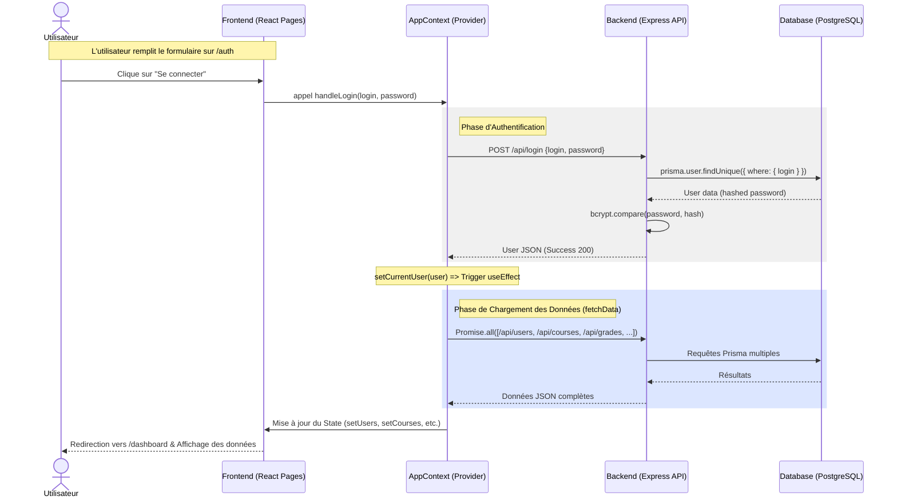

# Diagramme de Séquence - Parcours Principal

Ce document détaille les interactions entre les différents composants de l'application **AI-Week** lors du parcours utilisateur principal : la connexion et le chargement initial du tableau de bord.

## 🔄 Flux d'Authentification et de Chargement

## 📝 Description des étapes

1. **Phase d'Authentification** : 
    - Le `AppContext` gère la communication avec l'API `/api/login`.
    - Le backend vérifie le mot de passe hashé via `bcrypt`.
    - En cas de succès, l'objet utilisateur (sans le mot de passe) est renvoyé au client.

2. **Phase de Synchronisation** : 
    - Dès que `currentUser` est défini, un `useEffect` dans le `AppContext` déclenche `fetchData()`.
    - Cette fonction exécute 7 requêtes `GET` en parallèle vers les différents services métier (Schedule, Grades, Messages, Tasks, etc.).

3. **Phase de Rendu** : 
    - Une fois les promesses résolues, les états globaux du contexte sont mis à jour.
    - React déclenche un re-rendu massif des composants abonnés, affichant ainsi le tableau de bord avec les informations fraîches.
